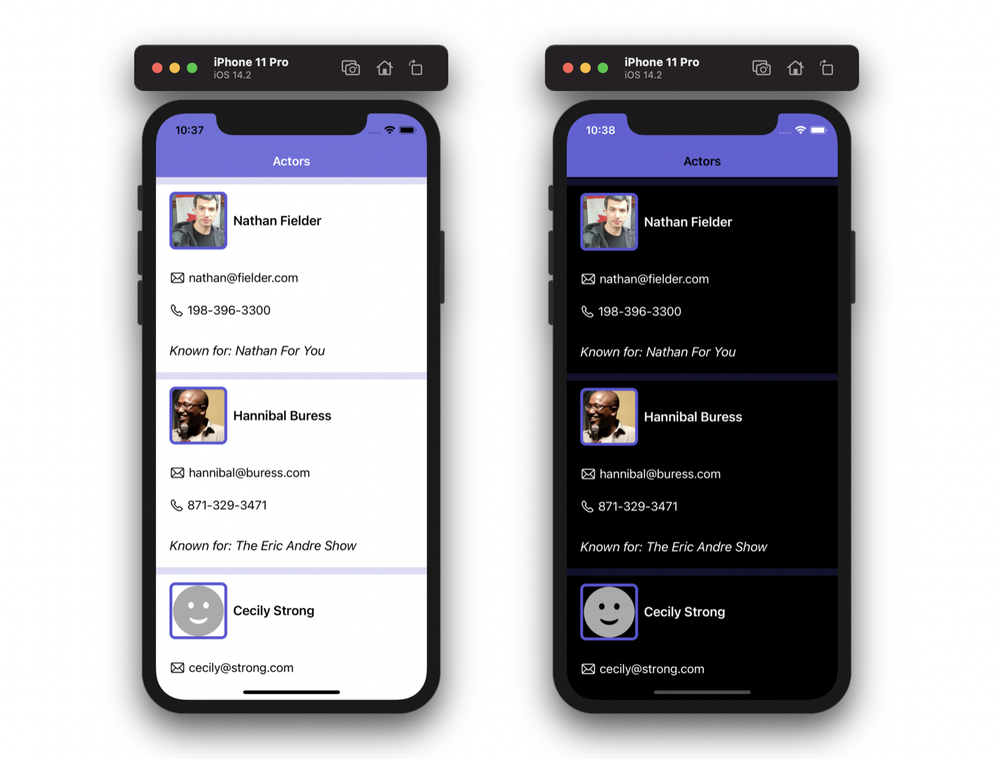

# 🎬🤩 Actor Directory

A sample application that represents a directory of actors.

Built for iOS 14 with UIKit, using a completely programmatic layout.



---

## Setup

1) Clone this project.
2) Open `ActorDirectory.xcodeproj`.
3) Run the application.

**Notes:**

You can use a local URL to fetch data or use a remote URL to fetch data by changing the following option in `ViewController.swift`:

```swift
// Use a local path:
NetworkService.executeRequest(for: RoutingPath.actorsStaging) {...}

// Use a remote URL:
NetworkService.executeRequest(for: RoutingPath.production) {...}
```

---

## Tests

There are unit tests in the `ActorDirectoryTests` target to test the decoding of JSON data.